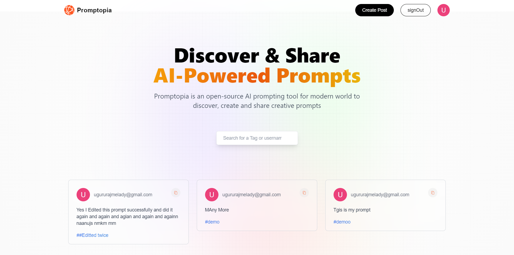

# Promptopia - AI Prompt Sharing

Welcome to **Promptopia**, an open-source **Next.js** application that empowers users to discover, create, and share AI prompts effortlessly. This app provides full **CRUD** functionality with dedicated pages such as **Home**, **Feed**, **Create Prompt**, and **Profile**, all secured with **NextAuth** for seamless authentication. Unleash your creativity in the digital realm with Promptopia.




## Features

- **Discover and Share AI Prompts**:  
  Explore a creative space where users can discover, create, and share AI prompts.
  
- **CRUD Functionality**:  
  Effortlessly **Create**, **Read**, **Update**, and **Delete** prompts.

- **Dedicated Pages**:  
  - **Home Page**
  - **Feed Page**
  - **Create Prompt Page**
  - **Profile Page**

- **Authentication**:  
  Secured with **Auth.js (NextAuth)** for seamless and secure user authentication.

---

## Tech Stack

### Frontend
- **React**
- **Next.js**
- **Tailwind CSS**

### Backend
- **MongoDB** for data storage

### Authentication
- **Auth.js (NextAuth)** for user authentication

---

## Getting Started

To get started with **Promptopia**, follow these steps:

### 1. Clone the Repository:

```bash
git clone https://github.com/your-username/promptopia.git
